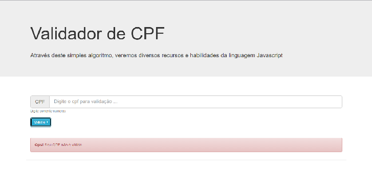

# Hiring-Projeto2 

### Criando um validador de CPF

## 🏁 Tópicos
 
  * 👉 [Banner](#📷-banner)
  * 👉 [Título](#📌-título)
  * 👉 [Descrição](#✒️-descrição)
  * 👉 [Status](#⏱️-status)
  * 👉 [Funcionalidades](#🔨-funcionalidades-🛠️)
  * 👉 [Demonstração](#🚀-demonstração)
  * 👉 [Pré-requisitos](#📋-pré-requisitos)
  * 👉 [Tecnologias utilizadas](#⚙️-tecnologias-utilizadas)
  * 👉 [Acesso ao Projeto](#📁-acesso-ao-projeto)
  * 👉 [Pessoas Contribuidoras](#🖇️-pessoas-contribuidoras-🤝)
  * 👉 [Autor](#🏆-autor)
  * 👉 [Licença](#🙏-licença-🔖) 
  * 👉 [Conclusão](#📚-conclusão)
 
 
______________________________________________________________

## 📷 Banner
  

    
  

______________________________________________________________

## 📌 Título

#### Criando um validador de CPF

______________________________________________________________
## ✒️ Descrição

#### O desafio foi acompanhar a criação de validação de CPF utilizando o JavaScript, conheci como foi feito o processo e a lógica utilizada, amei a aula, segue o resultado.

______________________________________________________________
## ⏱️ Status

>  🚀 Projeto Concluído com Sucesso!!! 👌 🚧

______________________________________________________________
## 🔨 Funcionalidades 🛠️

- `1 ` Validar se o cpf digitado é válido ✔️

______________________________________________________________
## 🚀 Demonstração 

> 🚧 Em construção 🚧

______________________________________________________________
## 📋 Pré-requisitos 

- ✔️ Nenhum

______________________________________________________________
## ⚙️ Tecnologias utilizadas

- [HTML](link)
- [CSS](link)
- [Bootstrap](link)
- [JavaScript](link)

## 📁 Acesso ao Projeto 

### [Projeto](https://alinealmeida85.github.io/Hiring-Projeto2/)

______________________________________________________________
## 🖇️ Pessoas Contribuidoras 🤝
[ Aline Melissa Andrade de Almeida](https://github.com/AlineAlmeida85) 

______________________________________________________________
## 🏆 Autor 

  [ Aline Almeida 💝](https://github.com/AlineAlmeida85) 

______________________________________________________________
## 🙏 Licença 🔖

#### Não Possui
______________________________________________________________
## 📚 Conclusão 

#### O desafio foi acompanhar a criação de validação de CPF utilizando o JavaScript, conheci como foi feito o processo e a lógica utilizada, amei a aula, segue o resultado.
______________________________________________________________

⌨️ com ❤️ por [Aline Almeida](https://github.com/AlineAlmeida85) 😊

Espero que te agrade! 

